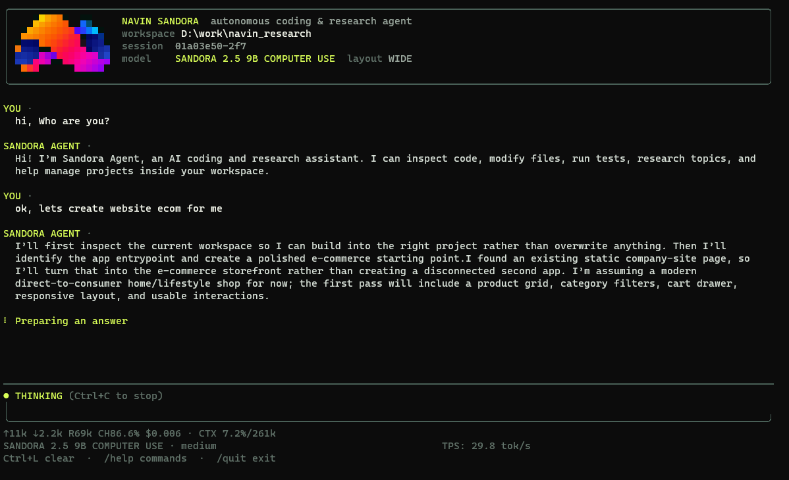

# Sandora Agent CLI



**Sandora Agent CLI** is a terminal-first autonomous coding and research agent built on the [Pi agent runtime](https://github.com/earendil-works/pi). It can inspect a repository, edit files, run commands and tests, recover from failures, use Git, and delegate focused work to parallel subagents.

> **Status:** Active MVP development. The public CLI is usable for local coding and research workflows; browser and direct computer-use tools are not enabled yet.

## What it can do

- Read, search, create, edit, and delete files in the current workspace
- Run PowerShell commands, builds, tests, and development tools
- Inspect errors, repair failures, and test again
- Review Git status, diffs, history, and branches
- Commit, push, and assist with pull-request workflows when requested
- Delegate up to four parallel read-only exploration or review tasks
- Preserve session context through Pi
- Show live activity such as `THINKING`, `RUNNING`, `TYPING`, and `COMPLETE`

## Private Sandora model preview

**Sandora 2.5 9B Computer Use** is currently being evaluated privately and is not publicly available.

Interested in early access? [Open a Private Model Access request](https://github.com/kyoo-147/SandoraAgent-CLI/issues/new?title=Private%20Model%20Access) and briefly describe your intended use case.

The displayed model name is currently a product label. The public MVP can run with other providers through Pi.

## Quick start

Requirements: Node.js and npm.

```bash
git clone https://github.com/kyoo-147/SandoraAgent-CLI.git
cd SandoraAgent-CLI
npm install
npm start
```

Configure provider credentials in Pi before launch, or set the environment variable required by your provider.

```powershell
$env:OPENAI_API_KEY="..."
npm start
```

## Multi-provider support

Sandora is not locked to a single model vendor. Pi provides the model and provider abstraction, so Sandora can use compatible providers already configured in the local Pi environment.

Credentials remain on the user's machine and are not stored in this repository.

## How it works

Pi provides the agent loop, sessions, streaming events, provider integration, and core coding tools. Sandora adds its own terminal interface, product identity, activity states, workspace policy, slash commands, and bounded parallel subagent workflow.

The parent agent remains responsible for planning, edits, integration, testing, review, and Git delivery. Delegated workers are intentionally read-only in the MVP.

## Commands

Type `/` in the CLI to open command completion.

```text
/help       Show help
/tools      Show enabled capabilities
/status     Show agent and model status
/session    Show session and workspace information
/clear      Clear the current view
/quit       Exit Sandora
```

Additional commands support explanation, comparison, evidence review, research briefs, critique, summarization, and translation.

## Safety

Sandora is designed to work autonomously inside the selected workspace. It is instructed to preserve unrelated changes, avoid credential exposure, review diffs, and run tests before Git delivery.

The parent process runs with the permissions of the current user. Use a container or OS sandbox when stronger isolation is required. Worker restrictions in this MVP are application-level, not a security boundary.

## Development

```bash
npm run check
npm test
```

## Current limitations

- Browser and direct computer use are not enabled
- The Sandora model remains in private evaluation
- Subagents are read-only and limited to four concurrent tasks
- No default GitHub Actions workflow is included yet

## Acknowledgements

Sandora uses [Pi](https://github.com/earendil-works/pi) as its runtime foundation. The broader terminal-agent ecosystem also provides useful design references:

- [DeepSeek Harness](https://github.com/deepseek-ai/deepseek-harness)
- [OpenAI Codex CLI](https://github.com/openai/codex)
- [Google Gemini CLI](https://github.com/google-gemini/gemini-cli)
- [Grok Build](https://github.com/xai-org/grok-build)
- [Kimi Code CLI](https://github.com/MoonshotAI/kimi-code)
- [Kimi CLI](https://github.com/MoonshotAI/kimi-cli)

Pi is distributed under the MIT License. Sandora-specific branding, interface, launcher, and integrations are maintained in this repository.
